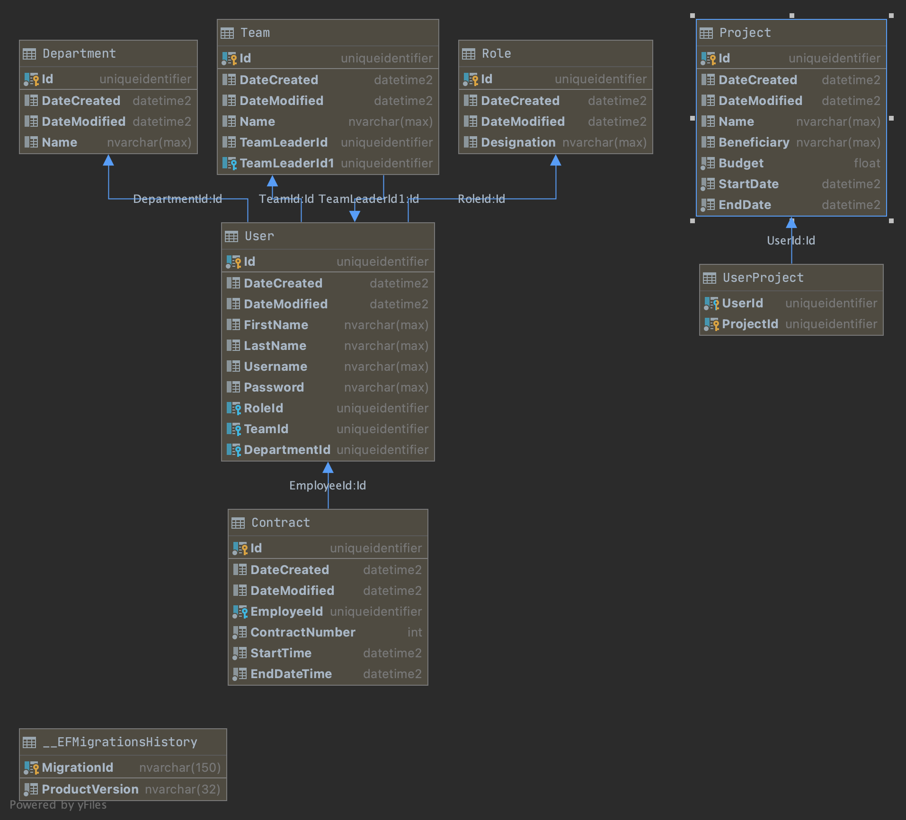
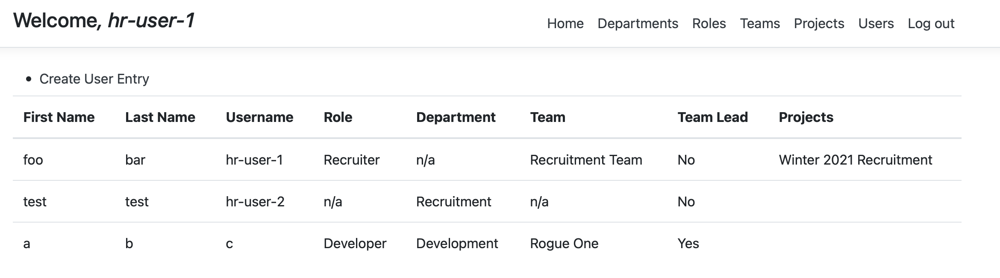

# Proiect_DAW
Proiect Dezvoltarea Aplicatiilor Web

Tema aleasa este o platforma de HR unde se pot centraliza 
si gestiona detalii despre angajatii unei firme.

In urmatoarele capitole se vor prezenta detaliile de implementare.

### Model

### Implementarea Serviciilor

Exista trei tipuri de servicii care inglobeaza diferite functionalitati ale platformei.

##### Organization Service

Aceste are scopul organizarii informatiilor despre angajati (rolul, departamentul)

##### Engagement Service

Aceste are scopul organizarii informatiilor despre activitatea angajatilor (echipa, proiectul)

##### User Service

Acest serviciu este folosit pentru crearea intrarilor in baza de date care descriu informatii despre 
un angajat, cat si informatii despre contractul sau.  
  
Tot in aceleasi loc exista implementata si functionalitatea de autentificare a utilizatorului in platforma.

### Legaturile in Frontend

Dupa definirea tuturor API-urilor (in acest proiect, sunt o oglindire a functiilor oferite de servicii),
Am creat modulele necesare compunerii acestei platforme (engagement, organization).  
  
In acestea avem incapsulate toate componentele necesare platformei

Un exemplu de ecran este panoul angajatilor.

